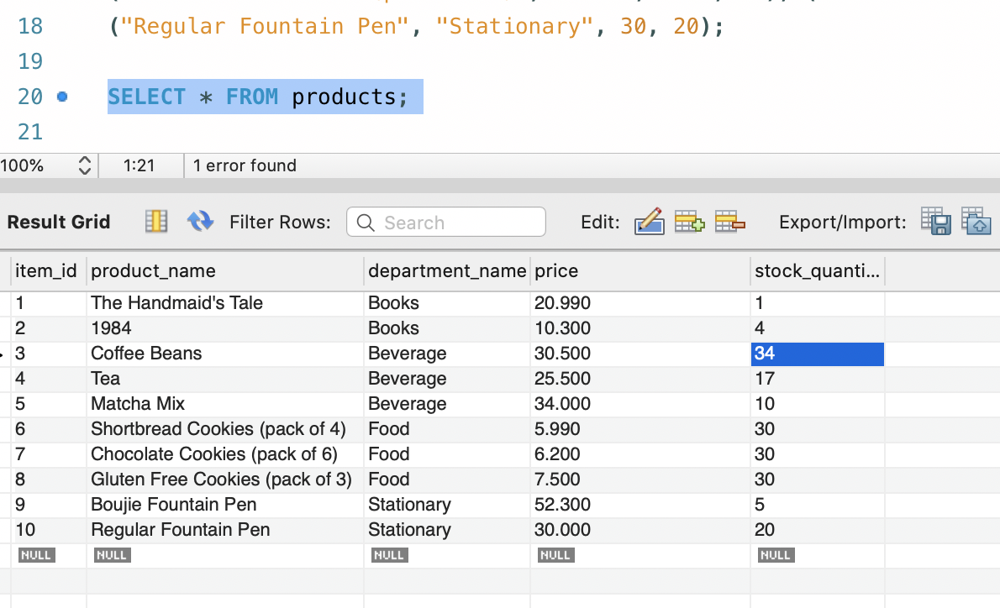

# bamazon

This is a CLI application to view and order items within a an online shopping store. 

## How to Use

Download the bamazon.js file and the package.json file. The user must download the mysql and inquirer packages from npm. 

### Steps on running the file
1. Once the user runs the file, the list of all items in the store will be displayed.
2. The user must select if they wish to make a purchase or not and the option to exit the file will be provided
3. If the user decides to purchase any product, they must enter the item ID
4. CLI will display the product associated with the ID
5. User must enter the quantity of products and if the stock inventory is lower than the desired quantity, a message will be displayed for the user. If there is inventory, the user will be provided the total cost of purchase. 

#### Screenshots for when inventory is low

* Only 1 item available in the inventory for *Item 1*. 

* Screenshot of CLI response: 

* When the last item is purchased, the user is provided the total and the inventory falls to 0. 

### Screenshots for another item where inventory is high

* Total inventory for Coffee Beans is 44 in the database. 

* Total items ordered: 10. The order is successful and the total is displayed for the user. 

* Updated inventory for Coffee Beans is 34 in the database. 